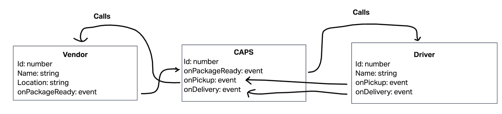

# CAPS Delivery

## Description

On an interval, emits packages of data that are slowly passed down an event chain.
Demonstrates how events work!

## UML

## How to use

run `npm i`
run `npm start` to begin, ^C to kill
run `npm v` for the vendor
run `npm d` for the delivery. All three should be running to show how this works.
run `npm test` to run tests

## Helpful people

Zayah, Derek, and Luis for coding alongside me and inspiration for how to tackle the problem
Stackoverflow for sleep helper implementation reference
